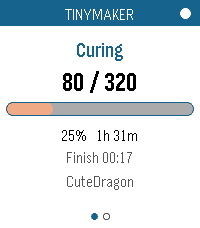
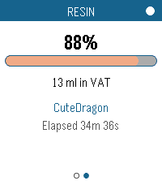

# TinyMaker Print Monitor

A Pebble watchapp that watches an active print on a **TinyMaker** resin printer
running the [TinyMakerWifi](https://github.com/slibbinas/TinyMakerWifi) community
firmware — layer counter, progress, time remaining, resin level — updated live
over WiFi, with a vibe when the print finishes, stalls on low resin, is
cancelled, or needs power-loss recovery.

Built to [`docs/PLAN.md`](docs/PLAN.md). The printer API was reverse-engineered
against a live print; findings are in [`docs/API-NOTES.md`](docs/API-NOTES.md).

| Status | Resin |
|---|---|
|  |  |

*Live data from a real print, on Pebble Time 2 (emery).*

## How it works

Pebble hardware has no WiFi radio, so the watch is purely a display:

```
Printer  ──HTTP/MQTT──▶  Phone (PebbleKit JS)  ──AppMessage──▶  Watch (C)
```

The phone-side bridge normalises whatever the printer reports into one fixed
schema, rate-limits it, and pushes it to the watch. The watch never talks to the
printer, and never sends it commands — this app is read-only.

## Screens

**Status** — print phase (Curing / Lifting / Peeling / Paused …), current layer
over total, an orange progress bar, percent, time remaining and the estimated
finish clock time.

**Resin** — resin left as a percentage of the VAT and in millilitres, a
low-resin banner when the firmware raises the flag, the print name and elapsed
time.

### Controls

| Action | Button | Touch (Emery / Gabbro) |
|---|---|---|
| Switch page | Up / Down | Swipe left or right |
| Force a refresh now | Select | Tap the progress bar |
| Show "last updated" | — | Tap the dot in the header |
| Exit | Back | — |

Every touch gesture has a button equivalent, so the app behaves identically on
non-touch hardware. The dot in the header is white while data is fresh and turns
red once nothing has arrived for 50 seconds.

## Setup

Open the app's settings in the Pebble phone app.

**Dashboard polling (works out of the box).** Set **Printer host** to
`tinymaker.local` (or the printer's IP). Leave **Status path** blank — the app
finds `/api/status` itself and re-probes if a firmware update moves it. The
phone must be on the same WiFi as the printer.

**MQTT (optional, needs setup).** TinyMakerWifi ships with MQTT *disabled*, so
this path needs work on your side first:

1. Enable MQTT on the printer and point it at a broker.
2. Give that broker a **WebSocket** listener — PebbleKit JS cannot open a raw
   TCP connection, so the printer's port 1883 is not reachable from the phone.
   In Mosquitto that is `listener 9001` + `protocol websockets`.
3. Enter `ws://<broker>:9001` as the **Broker WebSocket URL**.

The app then reads the printer's Home Assistant auto-discovery configs to learn
which topics carry which values, rather than hard-coding topic names.

With **Source** left on *Auto*, it tries MQTT and silently falls back to
dashboard polling — so leaving the broker URL blank just uses the dashboard.

**Update cadence** defaults to every 20 s while printing and every 3 minutes
while idle. The printer's ESP32 serves its dashboard in the gaps between layer
moves, so there is nothing to gain from polling harder.

## Testing without a print

`scripts/mock-printer.js` serves the same JSON shapes as the real firmware and
can be driven into states a real print rarely reaches on demand:

```bash
node scripts/mock-printer.js --scenario lowresin --port 8080
```

Scenarios: `print` (default), `idle`, `lowresin`, `finish`, `cancel`,
`powerloss`. Each triggers 20 seconds in, so there is time to open the app and
watch the transition. Point **Printer host** at `<this machine>:8080`.

## Building

```bash
npm install                                # @rebble/clay for the settings UI
pebble build
pebble install --emulator emery
pebble screenshot --no-open --emulator emery screenshot_emery.png
pebble install --phone 192.168.0.228       # real hardware
```

Builds for all seven platforms: aplite, basalt, chalk, diorite, emery, flint,
gabbro. The layout scales from a 144×168 aplite to a 260×260 round gabbro, and
the palette collapses to black-on-white on the monochrome watches.

## Deviations from the plan

Worth knowing if you are reading `docs/PLAN.md` alongside the code:

- **The data-source priority is inverted.** The plan made MQTT primary and
  dashboard polling the fallback. MQTT ships disabled on firmware 0.16.2, so
  polling is what actually works today. Both are implemented.
- **Five AppMessage keys were added** to section 6's schema: `ELAPSED_SEC` and
  `RESIN_USED_ML` (the firmware reports both, and the finished-print summary
  needs them), `CONN_STATE` and `CONN_MSG` (so the watch can tell "nothing is
  printing" apart from "the phone can't reach the printer"), and
  `REQUEST_REFRESH` (the watch-to-phone direction the plan's Select/tap refresh
  implies).
- **Two accent colours moved one step in the palette** so the progress fill and
  the low-resin warning stay distinguishable — reasoning in `docs/PLAN.md` §4.
- **The two screens share one window** rather than being separate windows, so
  paging is instant; `status_window.c` and `resin_window.c` keep the plan's file
  names and each render one page.
- **`ha_discovery.js` was split out** of `mqtt_client.js`, which the plan listed
  as owning "topic parsing" — the MQTT wire protocol and Home Assistant's
  discovery conventions are unrelated concerns.

## Status

Verified end-to-end against a live print on all display tiers in the emulator
(emery, gabbro, chalk, basalt, aplite). Plan section 7's last item — a full
print monitored on watch hardware — is still outstanding, as is anything MQTT,
which cannot be exercised until a broker exists.
