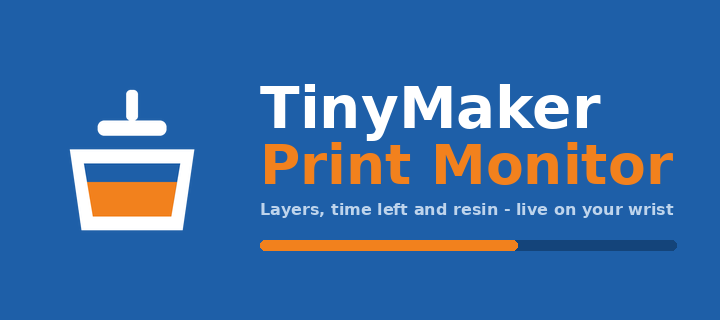

Watch a print on your **TinyMaker** resin printer from your wrist. Layer count,
time left, resin level — live, on any Pebble.

Requires the [TinyMakerWifi](https://github.com/slibbinas/TinyMakerWifi)
community firmware.

| Status | Resin |
|---|---|
|  |  |

## What it does

**Status page**
- Current print phase — Curing, Lifting, Peeling, Paused, Idle, Finished
- Layer counter, e.g. `142 / 860`
- Progress bar and percentage
- Time remaining, plus the clock time it'll finish
- Freshness dot: white when data is current, red once it's more than 50 s stale

**Resin page**
- Resin left as a percentage of the VAT, and in millilitres
- `LOW RESIN` banner when the printer raises its low-resin flag
- Print name and elapsed time

**Alerts** — distinct vibration patterns for print finished, low-resin pause,
print cancelled, and power-loss recovery. A finished print shows a summary card
with total time and resin used; a low-resin pause jumps straight to the resin
page. *(These only fire while the app is open — see [Limitations](#limitations).)*

**Controls** — every touch gesture has a button equivalent, so it behaves the
same on watches without a touchscreen:

| | Button | Touch |
|---|---|---|
| Switch page | Up / Down | Swipe left or right |
| Refresh now | Select | Tap the progress bar |
| Show "last updated" | — | Tap the header dot |
| Exit | Back | — |

**Two ways to get data** — polls the printer's web API, or subscribes to MQTT
if you have a broker. Picks automatically and falls back on its own.

**Runs on all seven Pebbles** — aplite, basalt, chalk, diorite, emery, flint,
gabbro. The layout rescales from 144×168 to 260×260 round, and the palette
collapses to black-on-white on the monochrome watches.

**Gentle on the printer** — polls every 20 s while printing, backs off to every
3 minutes when idle. The printer's single ESP32 serves its dashboard in the gaps
between layer moves, so there's nothing to gain from asking harder.

## Setup

Open the app's settings in the Pebble phone app and set **Printer host** to
`tinymaker.local` (or its IP). That's it — the app finds the status endpoint
itself. Your phone needs to be on the same WiFi as the printer.

For MQTT instead: enable it on the printer, give your broker a **WebSocket**
listener (Mosquitto: `listener 9001` + `protocol websockets` — PebbleKit JS
can't reach port 1883), and enter `ws://<broker>:9001`. The app reads the
printer's Home Assistant auto-discovery configs to work out the topics itself.

## Limitations

**The app has to be open.** PebbleKit JS only runs while the watchapp is in the
foreground, so nothing is polled — and no vibration fires — once you exit.

For alerts when you're not watching, use the printer's own notifications:
**tinymaker.local → Settings → Notifications** sends you a Telegram, WhatsApp or
Discord message when a print finishes, pauses for low resin, or is cancelled.
Those arrive on your phone and forward to your Pebble automatically. Use this
app for *checking on* the print; use those for *being told about* it.

## Build

```bash
npm install
pebble build
pebble install --emulator emery
pebble install --phone <your-phone-ip>
```

No printer handy? `node scripts/mock-printer.js --scenario lowresin` serves the
same JSON the firmware does and can be driven into `print`, `idle`, `lowresin`,
`finish`, `cancel` or `powerloss` on demand. Icons and store assets regenerate
with `python3 scripts/make-icons.py`.

## Docs

- [`docs/PLAN.md`](docs/PLAN.md) — the project plan this was built to
- [`docs/API-NOTES.md`](docs/API-NOTES.md) — the printer's API, reverse-engineered
  against a live print on firmware 0.16.2, including the field traps that bite
  anyone parsing it

Verified end-to-end against a live print on emery, gabbro, chalk, basalt and
aplite. MQTT is implemented but untested — the firmware ships with it disabled,
so there was no broker to try it against.
